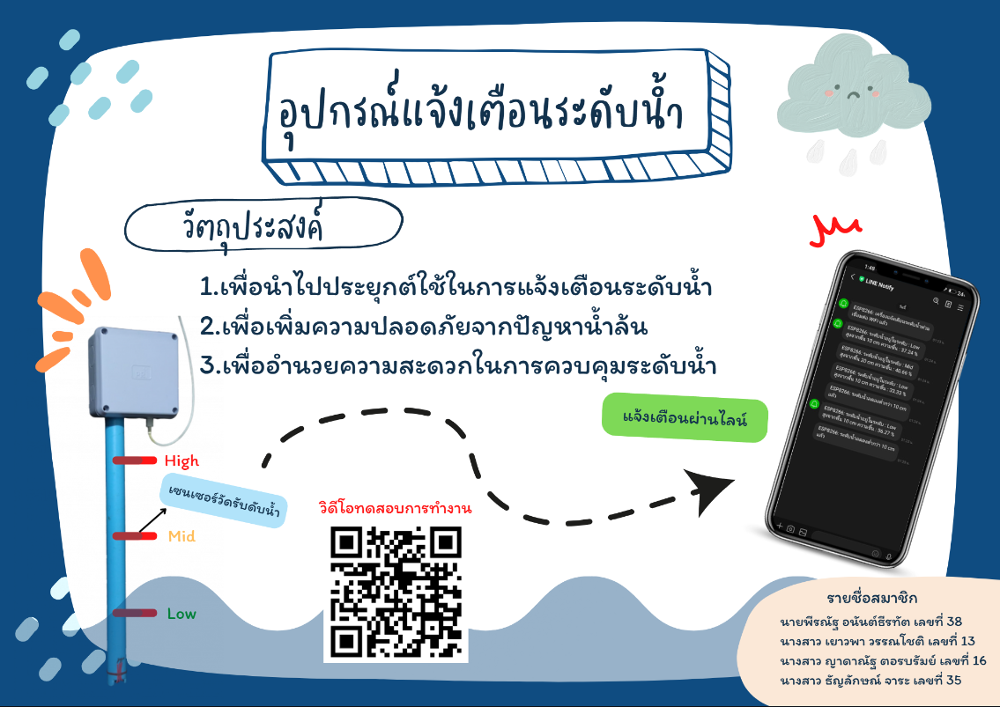

# IOT Water Level Monitoring System

โปรเจกต์ระบบตรวจวัดระดับน้ำด้วย IoT เพื่อช่วยตรวจสอบปริมาณน้ำในถังแบบ Real-time โดยใช้เซนเซอร์วัดระดับน้ำและไมโครคอนโทรลเลอร์

## Technologies
- Arduino / ESP8266
- C++
- Water Level Sensor

## Project Poster

📄 [View Full Poster](Poster.pdf)
